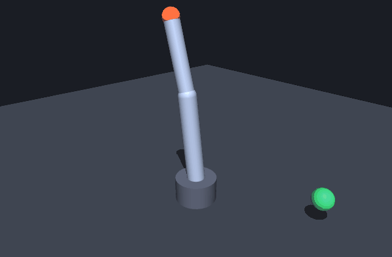

# NOVA — Next-gen Open Virtual AI

A place to test your own reinforcement learning code against a real physics
simulator, when you don't have a robot.

You write the algorithm. NOVA supplies an accurate simulation, a set of robots,
tasks with legible reward functions, live visualisation of what your policy is
actually doing, and honest scoring on episodes your code never saw.

Runs entirely on your own machine. No hardware, no cloud, no accounts.

[](https://github.com/aryanb1324/nova/actions/workflows/ci.yml)



**[Findings](docs/FINDINGS.md)** — measured results, including a cross-embodiment
transfer study and a conclusion this project got wrong, then corrected.

```bash
python3.12 -m venv .venv
.venv/bin/pip install -r backend/requirements.txt
.venv/bin/pip install -e ./backend
./dev.sh          # backend on :8000, frontend on :5173
```

`dev.sh` runs until you stop it — a foreground dev server, not a hung job.
Stop it with `lsof -ti:8000,5173 | xargs kill`.

## Write your own algorithm

Open http://localhost:5173, switch to **Your code**, pick a starting point, and
hit Run. Your script runs as a normal process on your machine; its output streams
into the console, and its reward curve and 3D rollouts appear in the same panels
as everything else.

Prefer your own editor?

```bash
nova init my-experiment
cd my-experiment && python train.py
```

Either way the API is small:

```python
import nova

env = nova.make("reach", "reach_arm")   # a normal Gymnasium environment
#   observations are already scaled; actions are continuous in [-1, 1]

with nova.attach(algo="my method", total_steps=400_000) as run:
    ...                                  # your training loop
    run.log(step=steps, mean_reward=score)   # draws on the chart
    run.rollout(policy)                      # plays in the 3D viewer

nova.export(policy, "mine.onnx", task="reach", template="reach_arm")
print(nova.evaluate("mine.onnx"))
```

`policy` only has to be a torch module mapping `(batch, obs_dim) → (batch, act_dim)`.

### Starting points

Five reference implementations ship in the editor and as real files under
`backend/nova/starters/`. They are deliberately *not* factored into a shared
framework, because the first thing you do is change the middle of the loop.

| Starter | What it is | Held-out success |
|---|---|---|
| `blank` | The loop with the algorithm removed | — |
| `reinforce` | Vanilla policy gradient, ~90 lines of torch | **1% ± 1** |
| `cem` | Cross-entropy method — no gradients at all | **3% ± 4** |
| `ppo_minimal` | Readable PPO with GAE and clipping, no RL library | **70% ± 16** |
| `sb3_custom` | Keep PPO, swap in your own network | **87% ± 12** |

**Five training seeds each**, identical 400k-step budget, scored on held-out
episodes. Reproduce with `nova bench --seeds 5` (~27 min).

The ± is not decoration. An earlier version of this table reported single-run
numbers — 87% and 100% for the two PPO variants. Both were flattering: at five
seeds they are 70% and 87%, and the run-to-run spread is wider than several of
the differences a reader would want to draw from such a table. One run of an RL
algorithm is an anecdote.

What survives the error bars is the gap that matters. `reinforce` and
`ppo_minimal` are about the same length and see the same data; the difference
between 1% and 70% is entirely a learned baseline, importance ratios, and
reusing each batch.

`cem` is instructive differently. It drives its *training* return to about −9 and
still scores ~3% on unseen targets, because it optimises a fixed set of episodes
and memorises them. That is what held-out scoring exists to catch.

## A study you can run: does a policy survive a body it never trained on?

Because robots are parametric, NOVA can ask a question that usually needs a lab:
train on one arm, then run that policy unchanged on arms with different link
lengths, motor strengths, and limb masses.

```bash
python -m examples.cross_body_study --seeds 3     # ~2 min
```

Three training seeds, scored zero-shot on held-out episodes:

| body | success (held-out) | retained |
|---|---|---|
| baseline | 96% ± 5 | — |
| forearm +20% | 92% ± 5 | 97% |
| forearm +40% | 86% ± 12 | 90% |
| upper arm +20% | 94% ± 7 | 99% |
| both links +20% | 92% ± 8 | 97% |
| links −20% | 98% ± 2 | 102% |
| motors −30% | 96% ± 5 | 100% |
| motors −50% | 96% ± 5 | 100% |
| motors +50% | 96% ± 5 | 100% |
| heavy links +30% | 89% ± 2 | 93% |
| damping ×3 | 97% ± 6 | 101% |
| heavy links +60% *(under-actuated)* | 30% ± 6 | n/a — body cannot hold itself |

Two things stand out. **Transfer is far more robust than expected**: every
physically feasible perturbation retains ≥90%, and halving or adding 50% to motor
torque costs nothing measurable. **Mass is the expensive axis** — the only
geometry change that costs real performance is making the limbs heavier.

And the one catastrophic number is not a generalization failure at all. Scaling
link radius by 1.6 multiplies mass by 2.56, which pushes the torque needed to
hold the arm horizontal to 9.46 N·m against 8.00 N·m available. No policy can
control that arm. The study computes this and labels it, because an earlier
version of this table reported it as a transfer failure and the conclusion drawn
from it — "inertia breaks generalization" — was simply wrong.

That check lives in `nova/study/cross_body.py`; the raw per-seed data lands in
`cross_body.json`.

**This result did not survive its own follow-up.** The actuation-invariance above
turned out to be slack in a two-second episode: under a 0.8 s budget, weaker
motors lose 22 points and heavier limbs lose 37, while geometry is unchanged.
[Findings](docs/FINDINGS.md) has the numbers.

### Is running code safe?

Running a script you typed, on your own computer, is not remote code execution —
it is running a script. NOVA does not sandbox it, and pretending otherwise would
be theatre.

What matters is that it stays local, so that is what's enforced: the run endpoint
refuses any request that isn't from loopback, and `NOVA_CODE_EXECUTION=off`
disables the feature entirely. **If you put NOVA behind a reverse proxy, set that
variable** — a proxy makes every request look local. For a public deployment, the
supported path is uploading a trained `.onnx`, which is data and executes nothing.

## Scoring

```python
nova.evaluate("mine.onnx")
```

Every policy is scored twice: on **public seeds** (listed in `/api/catalog`, so
you can reproduce a score locally) and on **held-out seeds** derived from
`NOVA_EVAL_SALT`. Set that to something private and a submission cannot be tuned
against the episodes it will be graded on. The gap between the two is reported,
and it is usually the most informative number on the page.

## The simulation

MuJoCo 3.11 on CPU — the same engine used for most published robotics RL. Robots
are generated from parameters rather than authored, so every slider position is a
valid, simulatable body.

| Robot | Task | Observations | Actions | Episode |
|---|---|---|---|---|
| Reaching Arm | reach a target | 18 | 3 | 2 s at 50 Hz |
| Wheeled Rover | drive forward | 16 | 2 | 5 s at 50 Hz |
| Quadruped | walk forward | 34 | 8 | 5 s at 50 Hz |

Throughput is 12,000–16,000 environment steps/second on a 10-core M5. For
reference and measured across seeds on held-out episodes: the built-in PPO
reaches **96% ± 5** on reach (3 seeds), the rover drives **13.95 ± 0.87 m**
(3 seeds), and the quadruped travels **7.28 ± 1.17 m** (5 seeds).

The quadruped number was 3.34 ± 0.83 m until recently, and the cause was not the
reward — it was a physics bug. See [Findings](docs/FINDINGS.md).

Every parameter combination is checked: all 47 slider extremes across the three
templates compile and step without producing a non-finite state.

## Deploying it

NOVA runs as a single container: the frontend is built into `frontend/dist` and
served by FastAPI at `/`, with the API and websockets on the same origin.

```sh
docker build -t nova .
docker run --rm -p 8000:8000 \
  -e NOVA_EVAL_SALT="$(python -c 'import secrets; print(secrets.token_urlsafe(32))')" nova
```

A public deployment is **artifact-only**: people upload a trained `.onnx` policy —
data, scored in an isolated process — and the in-browser Python editor is off.
The image defaults to `NOVA_CODE_EXECUTION=off` and you should leave it there.

That default is load-bearing, not belt-and-braces. Uvicorn rewrites the client
address from `X-Forwarded-For`, so behind a same-host reverse proxy a forged
header could otherwise defeat the loopback check that guards code execution.
NOVA now also refuses code execution outright whenever proxy headers are present,
but the environment variable is still the setting you want.

Set `NOVA_EVAL_SALT` too, or held-out seeds are reproducible by anyone and the
held-out score means nothing. There is no auth, no quota, and no rate limiting.

[**docs/DEPLOY.md**](docs/DEPLOY.md) has the security model, sizing, and Fly.io steps.

## Use it as a library, or fork it

NOVA is a Python package, not just an app. `pip install -e ./backend` gives you
`import nova` anywhere, and the registries are open — you can add a robot or a
whole task **from your own package, without forking**:

```python
import nova

nova.register_template(nova.RobotTemplate(
    key="pendulum", name="Pendulum", description="...",
    params=(nova.ParamSpec("pole_length", "Pole length", 0.5, 0.2, 1.0),),
    builder=build_mjcf_from_params, tasks=("swingup",),
))

class SwingUpEnv(nova.RobotEnv):
    obs_layout = "swingup.v1"
    def _observe(self): ...
    def _reward(self, action): ...

nova.register_task("swingup", env=SwingUpEnv, name="Swing up", description="...")
```

That is all of it. Everything downstream reads the registry, so the robot
appears in `/api/catalog`, the browser generates sliders from its `ParamSpec`
list, and every trainer — built-in or your own — works against it unchanged. No
frontend edit, no fork.

To load your package into the running app:

```bash
NOVA_EXTENSIONS=my_package.robots ./dev.sh
```

A complete worked example is in `backend/examples/custom_robot.py` — a pendulum
with a swing-up task, defined entirely outside the `nova` package. Running it
trains to ~0.89 mean uprightness in about 25 seconds.

Licensed MIT, so forking and shipping your own version is fine.

## Bring your own robot

Drop an MJCF file on the **Robot** panel, or paste it in. It validates as you
type, previews in the 3D view before you save, and once saved behaves exactly
like a built-in — same training, same viewer, same policy export.

You don't declare what your robot can do. NOVA reads the compiled model and
tells you:

```
Valid — 3 bodies, 2 actuators, 8 DoF, 4.76 kg
Can be trained on: locomotion
not reach: needs a site named 'ee', needs a body named 'target',
           expects 0 free joint(s), found 1
```

The rules, all enforced (`GET /api/robots/requirements`, or
`nova.robots.contract.validate_mjcf`):

- **A single self-contained MJCF.** No `<include>`, no meshes, heightfields or
  textures. The browser is sent body poses, never asset files, so there would be
  nothing to draw them from — only `plane`, `sphere`, `capsule`, `ellipsoid`,
  `cylinder` and `box` can be rendered.
- **Explicit `ctrlrange` on every actuator**, since policies emit `[-1, 1]`.
- **Numerically stable** — it is simulated for 200 steps with no input and must
  stay finite.
- **It must provide some task's interface.** `reach` wants an `ee` site and a
  mocap `target` on a fixed base; `locomotion` wants exactly one free joint. A
  robot matching none is refused, with the reason for each.

Uploads are fixed geometry, so they have no sliders — the editor says so instead
of showing an empty panel. Camera framing is derived from the model's actual
extent, so a 20 cm gripper and a 3 m gantry both arrive framed.

Tasks declare their own interface via `requires=` on `register_task`, so a task
you add gets robot matching for free.

## Or just watch it work

```bash
nova demo
```

Trains a robot with the built-in PPO, exports the policy, scores it on unseen
episodes and uploads it back — narrating each step, in about 45 seconds.

## How it fits together

```
frontend/src/components/
  CodeEditor.tsx    CodeMirror Python editor
  CodePane.tsx      starters, run/stop, streaming console
  Viewer.tsx        3D scene and rollout playback
  RewardChart.tsx   streaming canvas chart
  ParamEditor.tsx   sliders generated from the backend's schema
  PolicyPanel.tsx   upload, score, public vs held-out
backend/nova/
  starters/         reference algorithms (real runnable files)
  robots/           parametric MJCF generators + the custom-robot contract
  envs/             Gymnasium envs, rollout recording, wire format
  training/         the built-in PPO
  policies/         ONNX export, upload validation, scoring
  api/              FastAPI: catalog, training, policies, attach, code runner
```

**The browser never runs physics.** A rollout is a scene description plus a
`[frame][body][x y z qw qx qy qz]` pose matrix — the viewer sets transforms and
nothing else. ~41 KB per 100-frame rollout, no WASM, and no chance of the browser
diverging from what the server actually simulated.

## Commands

```bash
nova demo                    # the whole loop, narrated
nova init my-experiment      # scaffold a project for your own editor
nova eval mine.onnx          # score a policy
nova catalog                 # robots and tasks
python scripts/verify.py     # 125 invariant checks, no server needed
python scripts/bench_vec.py reach reach_arm subproc 16 1 256 10 1024
```

## Tuning notes

Measured, not assumed — and the difference between the reach task working and
not working at all:

- **Learning rate dominates.** At SB3's default 3e-4 the policy collapses to a
  single fixed posture and ignores the target entirely — 0% success no matter how
  long it trains. At 1e-3 with `ent_coef=0.01` it reaches 100%.
- **Observation scale matters.** Positions are order 0.3 m while joint cos/sin
  features are order 1.0. Unscaled, the target is the quietest input to the
  network and gets ignored.
- **One torch thread.** With 16 env worker processes, letting torch spawn its own
  pool halves throughput (9.8k → 5.1k steps/s).
- **Truncation is not termination.** These episodes end on a step limit, not a
  failure, so the final state's value has to be bootstrapped back in. Get this
  wrong and you teach the agent that time running out is a catastrophe.

## Deliberately not here

Custom reward scripting, multi-robot environments, sim-to-real, accounts, a
sharing gallery — and **running uploaded code on a server**. People bring their
own algorithm by running it themselves; that is what keeps this honest about
what it is, and what keeps a public deployment from needing a sandbox.
